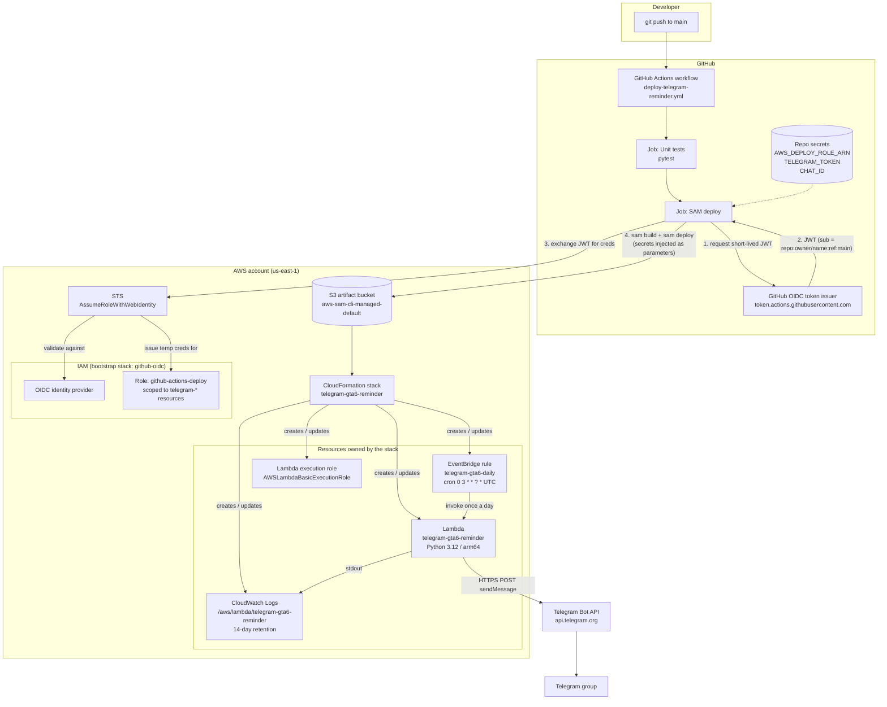

# Architecture

A serverless, scheduled Telegram bot deployed with infrastructure-as-code and a
keyless CI/CD pipeline. Every push to `main` runs tests and ships the Lambda to
AWS through CloudFormation, authenticated with GitHub OIDC instead of stored
access keys.

## Flow chart

Two independent loops share the picture:

- **Deploy loop** (top): developer → GitHub Actions → OIDC → STS → CloudFormation → resources. Runs on every push.
- **Runtime loop** (bottom): EventBridge → Lambda → Telegram. Runs once a day, no human involved.

## Components, one by one

### Repository layout

| Path | Role |
|---|---|
| `telegram-gta6-reminder/template.yaml` | SAM template. Declares the Lambda, its schedule, its log group. This is the source of truth for what exists in AWS. |
| `telegram-gta6-reminder/samconfig.toml` | Default flags for the SAM CLI (stack name, region, artifact bucket). Keeps the workflow command short. Contains no secrets. |
| `telegram-gta6-reminder/src/app.py` | Lambda handler. Builds the countdown message and calls the Telegram API. |
| `telegram-gta6-reminder/src/quotes.py` | Quote list and `random_quote()` helper appended to each message. |
| `telegram-gta6-reminder/tests/test_app.py` | pytest unit tests. Pure logic only, no network. |
| `infra/github-oidc.yaml` | One-time bootstrap CloudFormation template: OIDC identity provider + the IAM role GitHub Actions assumes. Deployed manually once, not by the pipeline. |
| `.github/workflows/deploy-telegram-reminder.yml` | The CI/CD pipeline. |

### `template.yaml` (AWS SAM)

SAM is a superset of CloudFormation. The `Transform: AWS::Serverless-2016-10-31`
line tells CloudFormation to expand SAM shorthand resources into plain
CloudFormation resources before deploying.

- **Parameters** — `TelegramToken` (`NoEcho: true` so it never appears in console
  or stack events), `ChatId`, `ScheduleExpression`, `ScheduleEnabled`. Secrets are
  parameters, not hardcoded, so the same template works for any bot/chat and the
  repo contains no credentials.
- **Globals** — runtime `python3.12`, architecture `arm64` (Graviton: cheaper and
  fine for pure-Python code), 128 MB, 10 s timeout. Applies to every function in
  the template.
- **`ReminderFunction`** (`AWS::Serverless::Function`) — expands into:
  - `AWS::Lambda::Function` with the code from `src/`, handler `app.lambda_handler`,
    and environment variables `TELEGRAM_TOKEN` / `CHAT_ID` filled from the
    parameters.
  - `AWS::IAM::Role` (execution role) with `AWSLambdaBasicExecutionRole`, which
    grants only `logs:CreateLogStream` / `logs:PutLogEvents`. Least privilege:
    the function needs nothing else.
  - `Events.DailySchedule` of type `Schedule` expands into an
    `AWS::Events::Rule` (EventBridge) named `telegram-gta6-daily` with the cron
    expression, plus an `AWS::Lambda::Permission` that lets EventBridge invoke
    the function.
- **`ReminderLogGroup`** (`AWS::Logs::LogGroup`) — declared explicitly so retention
  is 14 days instead of "forever" (the default if Lambda creates it lazily).
  `DeletionPolicy: Delete` so the log group goes away with the stack.
- **Outputs** — function ARN and rule name, printed at the end of `sam deploy`.

### `app.py` (the Lambda)

- `build_message(today)` is a pure function: given a date it returns the text.
  That is what the unit tests exercise.
- `send_telegram_message(text)` reads the token and chat id from environment
  variables (raises a clear error if missing), POSTs JSON to
  `https://api.telegram.org/bot<token>/sendMessage` with the standard library
  `urllib`, and **re-raises** on HTTP errors. Raising matters: a failed
  invocation shows up as an error in CloudWatch metrics instead of a silent
  200.
- `lambda_handler(event, context)` is the entry point EventBridge calls. It
  computes "today" in Mexico City time (fixed UTC-6, no DST since 2022) and
  glues the two functions together.
- No third-party dependencies. Cold start ≈ 80 ms, total ≈ 640 ms, 55 MB used.

### EventBridge rule

`cron(0 3 * * ? *)` in UTC = 21:00 Mexico City, every day. EventBridge is the
scheduler: it fires an event on the cron and invokes the Lambda. The rule and
the permission that allows it to invoke the function are both created by the
stack, so deleting the stack removes the schedule too. `ScheduleEnabled` can be
flipped to `"false"` to pause without deleting anything.

### CloudWatch Logs

Everything the function prints goes to `/aws/lambda/telegram-gta6-reminder`.
Retention 14 days. `sam logs --stack-name telegram-gta6-reminder --tail`
streams it.

### `infra/github-oidc.yaml` (one-time bootstrap)

Deployed once by hand with `aws cloudformation deploy`. Creates:

- **`AWS::IAM::OIDCProvider`** for `https://token.actions.githubusercontent.com`
  with audience `sts.amazonaws.com`. This registers GitHub as a trusted identity
  provider in the account.
- **`AWS::IAM::Role` `github-actions-deploy`** with:
  - a **trust policy** that allows `sts:AssumeRoleWithWebIdentity` only when the
    token's `sub` claim matches `repo:miguelhemmm/telegram-bot:ref:refs/heads/main`
    (also the newer `repo:owner@<id>/name@<id>:ref:...` form). Any other repo,
    branch, or pull request is rejected.
  - a **permissions policy** scoped to what `sam deploy` needs: CloudFormation on
    `telegram-*` stacks, Lambda/EventBridge/Logs on `telegram-*` resources, the
    SAM artifact bucket in S3, and IAM role management limited to
    `role/telegram-*` (so it can create the Lambda execution role but nothing
    else).

Why a separate template: it is account-level plumbing, deployed once, reused by
any future project in this repo. The application stack should not manage the
identity that deploys it.

### `.github/workflows/deploy-telegram-reminder.yml`

- **Trigger** — `push` to `main` with a `paths` filter (only when the project
  folder or the workflow itself changes) plus `workflow_dispatch` for manual runs.
- **`permissions: id-token: write`** — the line that makes OIDC possible. It lets
  the job ask GitHub for a signed JWT describing the run (repo, branch, commit).
- **`concurrency`** — one deploy at a time; two overlapping CloudFormation
  updates on the same stack would fail.
- **Job `test`** — checkout, Python 3.12, `pytest`. Fails fast before touching
  AWS.
- **Job `deploy`** (`needs: test`):
  1. `aws-actions/setup-sam` installs the SAM CLI.
  2. `aws-actions/configure-aws-credentials` with `role-to-assume`: takes the
     GitHub JWT, calls `sts:AssumeRoleWithWebIdentity`, receives temporary
     credentials (valid ≤ 1 h) for `github-actions-deploy`, and exports them as
     environment variables. No access key is stored anywhere.
  3. `sam validate --lint` — template sanity check.
  4. `sam build` — packages `src/` into a deployable artifact.
  5. `sam deploy` — uploads the artifact to S3, creates a CloudFormation
     changeset, executes it. Secrets are passed as `--parameter-overrides` from
     GitHub repo secrets, so they exist only in memory during the run.
     `--no-fail-on-empty-changeset` keeps the pipeline green when nothing
     changed.

## Request lifecycle, end to end

1. Developer pushes to `main`.
2. GitHub starts the workflow. Tests run.
3. The deploy job requests an OIDC token from GitHub. The token's `sub` claim is
   `repo:miguelhemmm/telegram-bot:ref:refs/heads/main`.
4. The job calls STS `AssumeRoleWithWebIdentity` with that token. STS checks the
   signature against the registered OIDC provider and the claims against the
   role's trust policy, then returns temporary credentials.
5. `sam deploy` uploads the zip to the SAM-managed S3 bucket and asks
   CloudFormation to create/update stack `telegram-gta6-reminder`.
6. CloudFormation diffs the template against the live stack and applies only
   the changes: new Lambda code, updated environment variables, changed cron.
7. Every day at 03:00 UTC EventBridge invokes the Lambda. The Lambda builds the
   message, POSTs to Telegram, logs the API response to CloudWatch.

## Interview talking points

**"Walk me through the project."**
It is a scheduled serverless bot. An EventBridge cron rule invokes a Python
Lambda once a day; the Lambda posts a message to a Telegram group. Everything
in AWS is declared in a SAM template and deployed by GitHub Actions on every
push to `main`, so the repo is the single source of truth for both code and
infrastructure.

**"Why SAM instead of raw CloudFormation, Terraform, or CDK?"**
SAM is CloudFormation with shorthand for serverless resources. One
`AWS::Serverless::Function` resource with an `Events.Schedule` block expands
into the function, its execution role, the EventBridge rule, and the invoke
permission. The CLI also handles packaging and uploading the code. For a
Lambda-centric project it is the least ceremony while still being native
CloudFormation underneath. Terraform or CDK would be the choice for
multi-cloud or for wanting a real programming language.

**"How does the pipeline authenticate to AWS?"**
GitHub OIDC. The workflow requests a short-lived JWT from GitHub, and the AWS
account has an IAM identity provider that trusts GitHub's issuer. The deploy
role's trust policy only accepts tokens whose `sub` claim is exactly my repo
and my `main` branch. STS exchanges the JWT for temporary credentials. There
are no long-lived access keys in GitHub, nothing to rotate, nothing to leak.

**"What can the deploy role do?"**
Only what `sam deploy` needs, scoped by resource name prefix: CloudFormation on
`telegram-*` stacks, Lambda/EventBridge/Logs on `telegram-*` resources, the SAM
artifact bucket, and IAM only on roles named `telegram-*`. Even if the token
were misused it could not touch anything else in the account.

**"How do secrets get to the Lambda?"**
GitHub repo secrets → `--parameter-overrides` on `sam deploy` → CloudFormation
parameters marked `NoEcho` → Lambda environment variables. The token is never
in the repo or in the template. For a production system I would put it in
Secrets Manager or SSM Parameter Store and let the function read it at
runtime, which also enables rotation without a redeploy.

**"How do you know a deploy worked?"**
Three layers. The Actions log shows the CloudFormation changeset and
`Successfully created/updated stack`. `aws cloudformation describe-stack-events`
shows each resource's status. Then `aws lambda invoke` plus
`sam logs --tail` proves the new code runs and the Telegram API returns
`ok: true`.

**"What broke and how did you debug it?"**
The first deploy failed with `Not authorized to perform
sts:AssumeRoleWithWebIdentity`. STS deliberately gives no detail. I looked at
CloudTrail `AssumeRoleWithWebIdentity` events and saw the incoming `sub` claim
was `repo:owner@<id>/name@<id>:ref:refs/heads/main`: GitHub had started
embedding numeric ids. My trust policy expected the classic form, so the
exact match failed. I added a second `StringLike` pattern with `@*`, which is
safe because `@` is not a legal character in GitHub names.

**"Why arm64?"**
Graviton is ~20% cheaper per ms and the function is pure Python with no native
wheels, so there is no compatibility concern. `sam build --use-container`
builds inside the matching image when the laptop lacks the right Python.

**"What would you change for production?"**
Secrets Manager instead of env vars; a dead-letter queue or `Retry` on the
EventBridge target so a Telegram outage is not silently lost; a CloudWatch
alarm on the `Errors` metric; EventBridge Scheduler (`ScheduleV2`) with
`ScheduleExpressionTimezone: America/Mexico_City` instead of hand-converting
UTC; separate stacks or parameter sets per environment (dev/prod) with a
branch-per-environment trust condition.

## Cost

Well inside the free tier: ~30 invocations/month × 0.7 s × 128 MB,
one EventBridge rule, a few KB of logs. Effectively $0.
